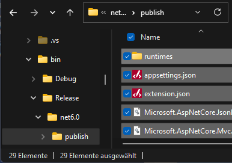

# Proffix REST API Extension Visual Studio Project Template für .NET 6.0

Dieses Template erleichtert den Einstieg in die Programmierung einer verwalteten Proffix REST API Erweiterung. Logging ist bereits integriert (Serilog), ebenso enthält das Template einen DemoController, mit welchem Anfragen an die Proffix REST API geschickt werden können. Wird ein aus dem Template erstelltes Projekt kompiliert, kann es direkt als Erweiterung verwendet werden.

## Voraussetzungen

- Proffix Installation
- Funktionierende Proffix REST API
- Proffix REST API Manager
- MS Visual Studio, welches .Net 6.0 unterstützt

## Installation

Die [*Proffix REST API Extension.zip*](https://github.com/Proffix-NET/RestApiErweiterungenTemplate/raw/master/PROFFIX%20REST%20API%20Extension.zip) muss ins Projekt-Template-Verzeichnis von Visual Studio kopiert werden (z.B. `"%USERPROFILE%\Documents\Visual Studio 2022\Templates\ProjectTemplates\"`).

**Hinweis:** Der tatsächliche Pfad kann im Visual Studio unter `Tools → Options... → Projects and Solutions → Locations → User project templates location` nachgeschlagen oder geändert werden.

## Verwendung

Sobald das Template am richtigen Ort gespeichert wurde, kann in Visual Studio unter `File → New Project... → Search for templates (Alt+S)` danach gesucht (`"Proffix REST API Extension"`) und damit ein neues Projekt angelegt werden.

> **Achtung!** Um später auftauchende Probleme zu vermeiden, soll der Projektname keine Leer- und Sonderzeichen enthalten.

Dieses Projekt kann sogleich mit der rechten Maustaste in einen Ordner gepublished und als Extension verwendet werden. Dazu muss der ganze Publish-Inhalt in eine Zip-Datei mit beliebigem Namen komprimiert werden, welche dann im Proffix REST API Manager importiert werden kann:



Wird die Erweiterung im Hauptfenster des Managers unter "Erweiterungen" importiert, so muss sie schliesslich noch auf der gewünschten Instanz aktiviert werden. Dazu muss auf der Instanz unter "Erweiterungen" das Plus-Symbol angeklickt werden. Es muss ein Instanzname angegeben und unter "Name" die gewünschte Erweiterung ausgewählt werden, falls es mehrere gibt.

> **Hinweis:** Die neue Erweiterung muss in der Tabelle mit dem Flag "aktiviert" installiert werden!

Mit dem Klick auf "Ok" wird die Erweiterung als Windows Service installiert und kann von der Proffix REST API verwendet werden. Diese Erweiterung ist jetzt auch im Proffix REST API Manager unter "Erweiterungen" sichtbar und kann dort verwaltet werden.

Die Erweiterung kann nun mit einem http-Request-Tool wie Thunder Client oder Postman getestet werden. Dazu loggt man sich erst bei der Proffix REST API ein (siehe REST API Dokumentation unter `Session und Login`) und schickt nachher z.B. den folgenden Request (entspricht dem Proffix WebEvent Adressänderung mit der Adressnummer 1 ohne LoginToken):
```url
POST {{BaseUrl}}/EXTENSION/<vendor>/<extensionName>/Demo
```
> **Hinweis:** `<vendor>` und `<extensionName>` stehen in der Datei extension.json.

Body:
```json
{
	  "Name":"pxUpdate ADR_Adressen",
	  "Data":{
	    "Schluessel":"1",
	    "Methode":"pxUpdate",
	    "Name":"ADR_Adressen",
	    "Datenbank":"PX000000"
	    }
}
```
> **Hinweis:** Das Feld Schlüssel (Laufnummer der Adresse) muss in der Proffix Datenbank vorhanden sein. Ausserdem muss gegebenenfalls der Name der Datenbank angepasst werden.

Wenn die Installation und die Weiterleitung erfolgreich war, wurde eine Logdatei im folgenden Verzeichnis geschrieben:
`
C:\ProgramData\Proffix REST API\Extension Instances\<InstanceName>\Logs
`
Im Log wird der Inhalt der Adresse mit der Nummer 1 angezeigt.

Will man die neu erstellte Erweiterung mit eigenen Funktionen anreichern, passt man am besten im Projektordner `Properties` den Port in der Datei `launchSettings.json` so an, dass er der installierten Erweiterung entspricht. Der zugehörige Dienst muss natürlich vorgängig deaktiviert werden.

## Debugging

Oben wurde beschrieben, wie man die Requests über die Proffix REST API auf die Entwicklungsumgebung weiterleitet. Somit lässt sich der Code auch einfach debuggen.
Als zweite Möglichkeit kann eine nicht verwaltete Erweiterung verwendet werden, welche die Anfragen an *http://localhost:5000* weiterleitet. Eine solche nicht verwaltete Erweiterung befindet sich verwendungsfähig in diesem Repository ([*RestApiDevelopmentExtension.zip*](https://github.com/Proffix-NET/RestApiErweiterungenTemplate/raw/master/RestApiDevelopmentExtension.zip)).
